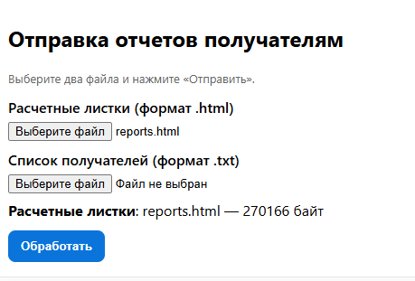
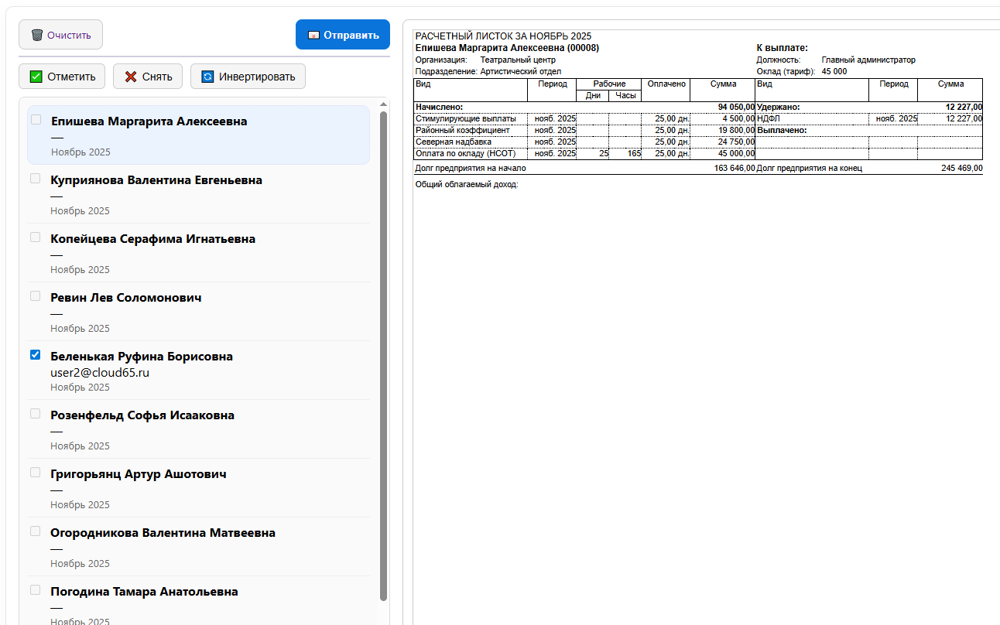

# Парсиг и отправка расчетных листков

[](LICENSE)
[](https://github.com/cloud65/report_parser/stargazers)
[](https://github.com/cloud65/report_parser/issues)
[](https://github.com/cloud65/report_parser/commits/master)

Это веб-приложение для загрузки расчетных листков и списка сотрудников, просмотра отчетов в браузере и отправки выбранных отчетов по электронной почте.

Пригодится, когда нет возможности отправить отчеты из 1С (например когда доступ серверу в интернет закрыт) 

---

## 🚀 Основные возможности

- Загрузка файлов:
  - HTML-файл с расчетными листками (`reports.html`)
  - TXT-файл со списком сотрудников (`users.txt`)
- Валидация форматов файлов
- Просмотр отчетов для каждого сотрудника в `iframe`
- Управление списком сотрудников:
  - Отметить все
  - Снять все
  - Инвертировать выбор
- Отправка выбранных отчетов по email
- Прогресс-бар загрузки файлов
- Безопасная вставка данных в HTML (`escapeHTML`)

---

## 📸 Скриншоты

<div align="center">
    
  
</div>

---

## ⚡ Быстрый старт

1. Клонируйте репозиторий:

```bash
git clone https://github.com/cloud65/report_parser.git
cd report_parser
```

2. Запустите локальный сервер (рекомендуется для API-запросов)
```bash
uvicorn main:app
```
и откройте `http://127.0.0.1:8000` в браузере.

3. Выберите файлы в `demo`:
   - `reports.html` — расчетные листки из отчета в **1С:ЗУП 3.1**
   - `users.txt` — список сотрудников из отчета `Списки сотрудников` в **1С:ЗУП 3.1**

4. Нажмите **Загрузить**, чтобы отправить файлы на сервер.

5. Просматривайте отчеты в `iframe` и управляйте выбором сотрудников.

6. Отправьте выбранные отчеты по email кнопкой **Отправить Email**.


## 🛠 API Endpoints

| Endpoint                  | Метод | Описание |
|----------------------------|-------|----------|
| `/api/v1/upload`           | POST  | Загрузка `report.html` и `employees.txt` |
| `/api/v1/reload`           | GET   | Получение текущего списка сотрудников |
| `/api/v1/report/:id`       | GET   | Получение HTML отчета конкретного сотрудника |
| `/api/v1/send`             | POST  | Отправка выбранных отчетов по email (JSON массив `id`) |


## 🛠 Переменные окружения
```bash
RP_CACHE_DIR=./out
RP_LOG_LEVEL=info
RP_EMAIL_HOST=smtp.example.ru
RP_EMAIL_PORT=587
RP_EMAIL_USERNAME=sender@example.ru
RP_EMAIL_PASSWORD=secret
RP_EMAIL_NAME="Отправка расчетных листков"
```

---

## 💻 Технологии

- Vanilla JavaScript (ES6+)
- HTML5 / CSS3
- XMLHttpRequest для прогресса загрузки (можно заменить на `fetch`)
- Современные браузеры
- Любой backend, поддерживающий API endpoints

---

## 📜 Лицензия

MIT License © sedaiko (cloud65)

